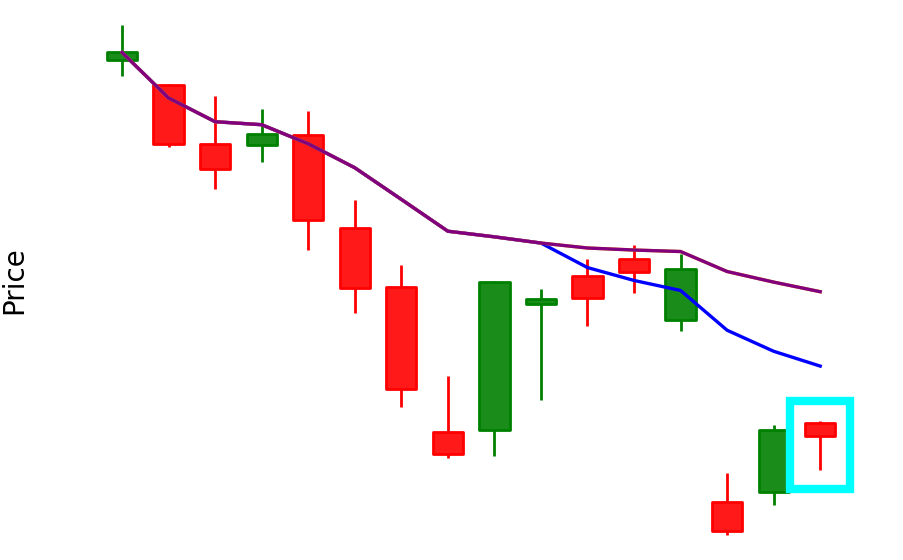

This project consists of two independent pipelines:
(1) a rule-based image generation system that converts historical market data into labeled candlestick chart images using RSI, candlestick patterns, and future price movement, and
(2) a CNN-based image classification model that learns to classify these images into technical trading pattern categories.

The project focuses strictly on image classification and pattern recognition and does not perform price prediction or trading execution.

Data Collection
===============

Historical OHLC data downloaded using Yahoo Finance

Covers multiple stocks, ETFs, and sectors

Rule-Based Label Generation

Candlestick patterns: Hammer, Shooting Star, Bullish & Bearish Engulfing

RSI regimes: ≤30 (oversold) and ≥70 (overbought)

Labels validated using future price movement

          
Image Generation
================

Candlestick charts generated using mplfinance

Moving averages (MA10, MA20, MA50) overlaid

Pattern candle highlighted with bounding box

Result: a custom multi-class image dataset

## Sample Generated Chart
<p align="center">
  
</p>


Classes
=======

RSI30_Hammer_UP

RSI70_Hammer_UP

RSI30_ShootingStar_DOWN

RSI70_ShootingStar_DOWN

RSI30_BullishEngulfing_UP

RSI70_BullishEngulfing_UP

RSI30_BearishEngulfing_DOWN

RSI70_BearishEngulfing_DOWN

Model
=====

Convolutional Neural Network (TensorFlow / Keras)

Regularization using Dropout and Early Stopping

Regularization using Dropout and Early Stopping


Results
=========
Total TRAIN images: 20332
Total VALIDATION images: 2883
Total TEST images: 704


Strong precision/recall across all classes

Minimal confusion between visually similar patterns

[**** This is a pattern recognition system, not a trading bot or price predictor.****]


## Confusion Matrix & Classification Report

```text
Confusion Matrix:
[[80  0  0  0  0  0  0  0]
 [ 0 83  0  0  0  0  0  0]
 [ 0  0 75  0  0  0  0  0]
 [ 0  2  0 84  0  0  0  0]
 [ 0  0  0  0 85  0  0  0]
 [ 0  0  0  0  0 98  0  1]
 [ 0  0  0  0  0  0 97  0]
 [ 0  0  0  0  1  0  0 98]]

Classification Report:
                             precision    recall  f1-score   support

RSI30_BearishEngulfing_DOWN       1.00      1.00      1.00        80
RSI30_BullishEngulfing_UP         0.98      1.00      0.99        83
RSI30_Hammer_UP                  1.00      1.00      1.00        75
RSI30_ShootingStar_DOWN          1.00      0.98      0.99        86
RSI70_BearishEngulfing_DOWN       0.99      1.00      0.99        85
RSI70_BullishEngulfing_UP         1.00      0.99      0.99        99
RSI70_Hammer_UP                  1.00      1.00      1.00        97
RSI70_ShootingStar_DOWN           0.99      0.99      0.99        99

accuracy                           0.99       704
macro avg                          0.99      0.99      0.99       704
weighted avg                       0.99      0.99      0.99       704

